# Industrial Production ERP (Upgraded from Home Inventory)

Welcome to the **Industrial Production ERP**! Originally developed as a Home Inventory Management System, this application is being systematically upgraded into a high-concurrency, auditable, and role-scoped ERP designed to manage a full-scale industrial tech manufacturing warehouse.

The platform tracks products from raw materials to final assemblies (e.g., IoT devices, drone components), manages departments (Manufacturing, Storage, Logistics, Finance, Marketing, HR, IT, Administration), enforces capability-based access control, tracks bottom-to-top issue reports with live notifications, and processes bills of materials (BOMs) with full traceability.

---

## 1. Project Overview

### Core Technology Stack
*   **Frontend**: React.js (Vite), React Router DOM v6+, CSS Modules, Axios (with Session Credentials), Native WebSockets.
*   **Backend**: Python 3.x, Django, Django REST Framework (DRF), Django Channels (WebSockets).
*   **Database & Infrastructure**: PostgreSQL (Primary DB), Redis (Cache & Message Broker), Celery (Background Tasks), Docker.

### Business Logic Summarized
*   **Inventory Hierarchy**: Strict top-down physical mapping: `Warehouse` &rarr; `Floor` &rarr; `Rack` &rarr; `Shelf (Location)`.
*   **Stock Rules**: Stock represents a specific `Product` at a specific `Location`. Stock levels **must never be negative**.
*   **Order Management**:
    *   **Purchase Orders (PO)**: Inbound stock. Supports partial and full receiving.
    *   **Work Orders (WO)**: Outbound stock (consumption). Reserves stock on issue; decrements stock on completion. Warns on insufficient stock.
*   **Predictive Pricing**: A background Celery worker analyzes market price trends to dynamically estimate future predictive prices.

### Process & Security
*   **Concurrency**: Every stock movement is enclosed within a `transaction.atomic()` block using `select_for_update()` and optimistic locking to prevent race conditions.
*   **Authentication**: Secure, HTTP-only Django Session Authentication. (No JWTs).
*   **Real-time**: Actionable events (e.g., low stock warnings, PO receipts) trigger instant WebSocket notifications.

---

## 2. Detailed Documentation

The project logic and guidelines are governed strictly by the AI Agent constraints. Refer to the underlying configuration docs:

*   **[GEMINI.md](file:///e:/Live/home_inventory/GEMINI.md)**: The single source of truth containing mandatory coding rules, file naming conventions, frontend/backend guidelines, security constraints, and forbidden agent actions.

---

## 3. Foundational Architecture & Workflow Maps

### 3.1. High-Level System Architecture

This diagram defines how the React client interacts with the Django backend via REST APIs and WebSockets, and how the backend distributes the workload.

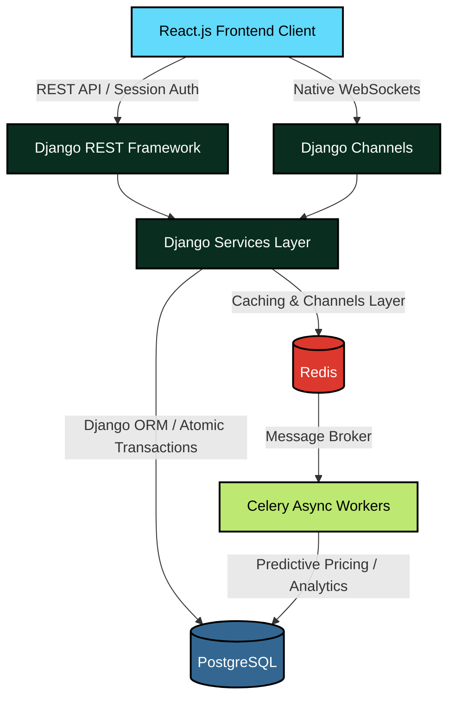

### 3.2. Inventory Hierarchy

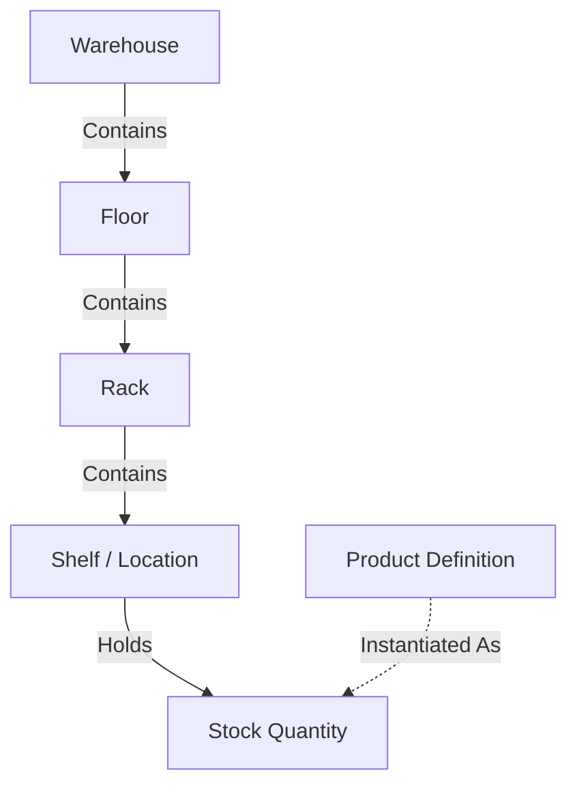

### 3.3. Legacy Order Processing Workflow (PO & WO)

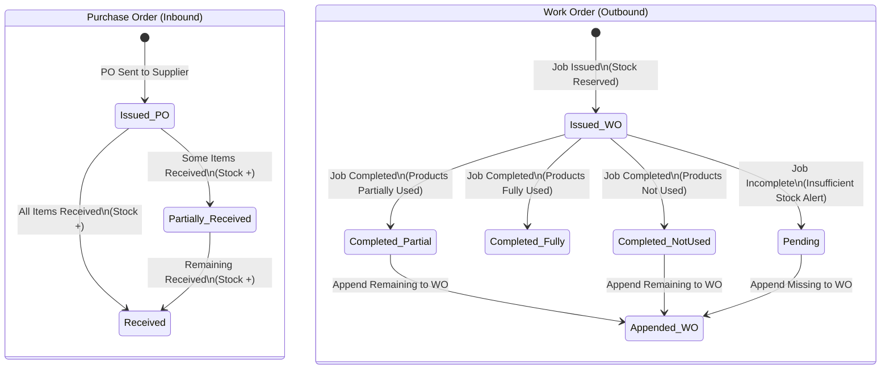

---

## 4. Industrial Production ERP Upgrade Plan

The system is undergoing a transition to handle full-scale manufacturing, logistics, and resource tracking. 

### 4.1. Facility Layout and Operational Flow
Below is a conceptual layout visualization of the target industrial facility showing the flow of materials through various departments.

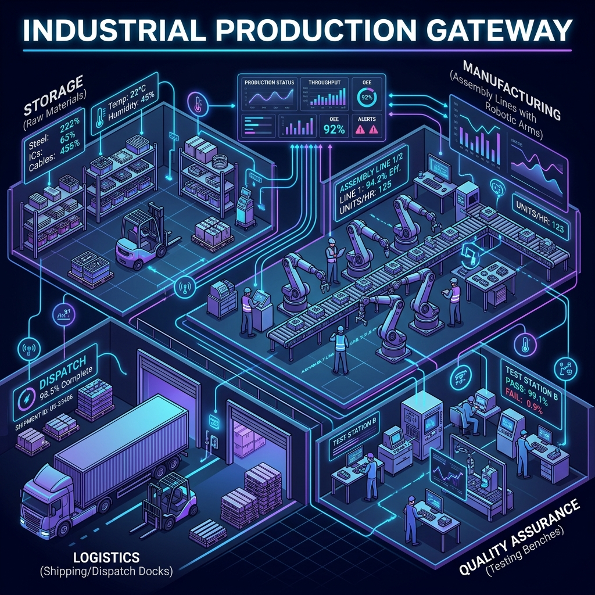

### 4.2. Upgrade Structural Diagrams

#### A. Organizational Structure & Reporting Lines
The hierarchy separates administrative, department-level management, team-level leadership, and shop-floor execution. A Team Lead can explicitly lead multiple teams. Reporting lines follow a bottom-to-top approach.

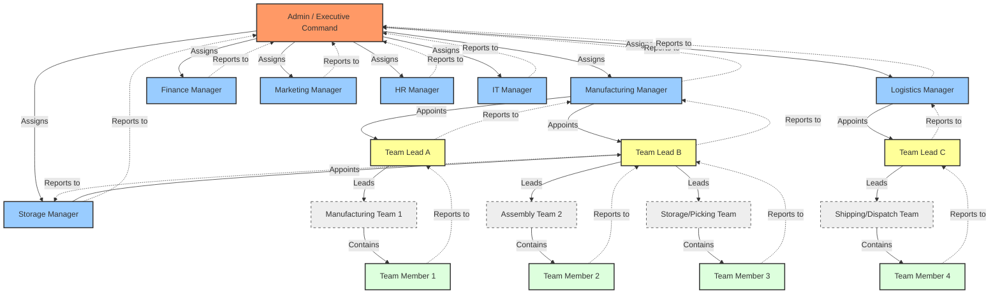

#### B. Capability-Based Permission Cascading
Access control shifts from simple user roles to granular scoped capabilities. Permissions are delegated top-to-bottom and are bounded by the scope of the delegator (Global, Department, Team, Location, or Object-scoped). Every grant is recorded in an immutable audit ledger.

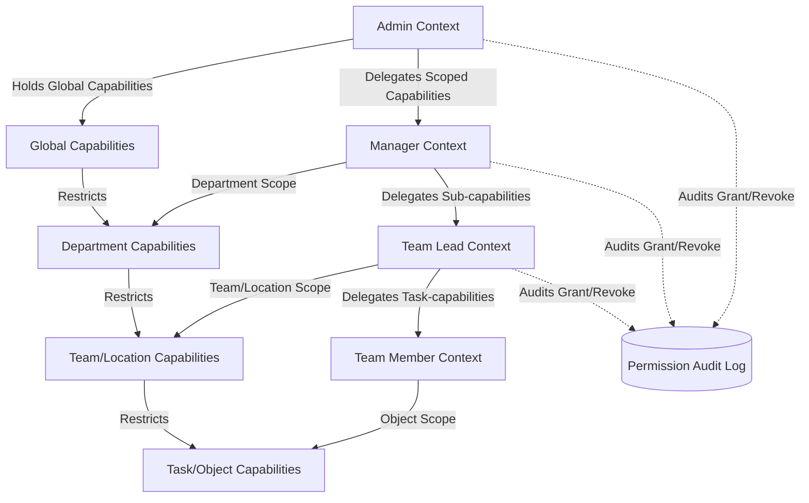

#### C. Bottom-to-Top Reporting & Escalation WebSocket Flow
All issues submitted by members flow up the reporting chain. Real-time updates route dynamically via Django Channels to specific WebSocket groups, ensuring only responsible personnel are notified. Celery background workers monitor SLAs and trigger alerts for breaches.

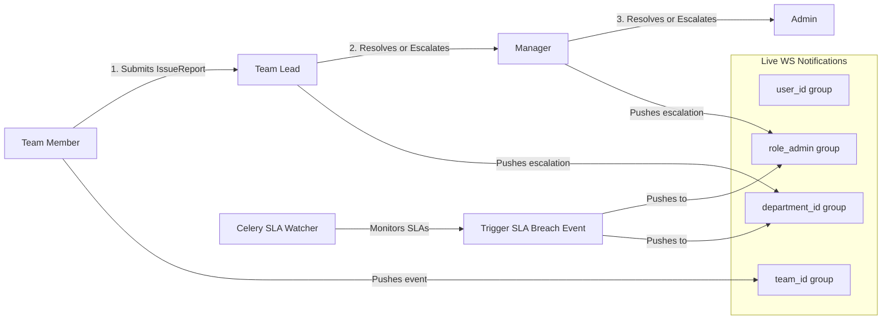

#### D. HR Token Submit & Delegated Case Lifecycle
The HR token system allows users to submit issues anonymously and track them via an immutable `HRToken`. Cases can be delegated by HR to managers or leads with a recorded reason, maintaining strict privacy gates.

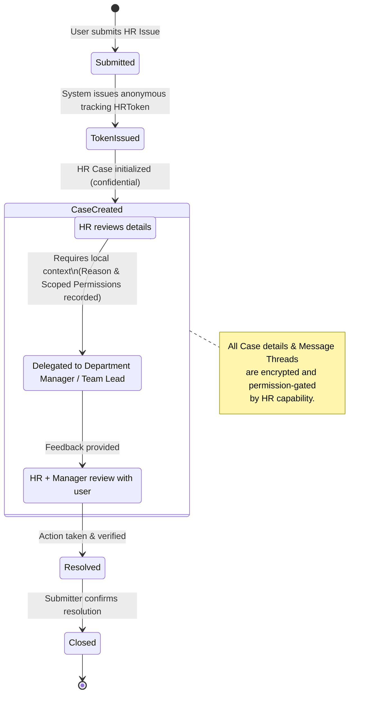

#### E. Industrial Inventory Lifecycle & Product Classification
Products are classified into Raw Materials, Modules, and Final Products. Stock records transition through formal inventory states based on operational activities (receiving, reservation, manufacturing issue, quality gating, and scrapping).

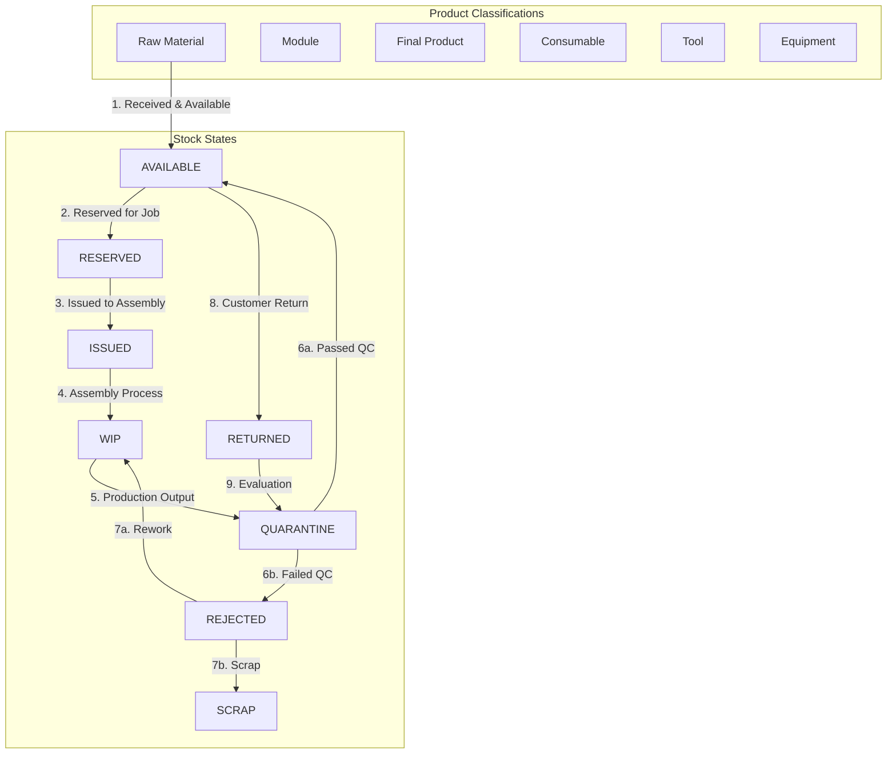

#### F. Manufacturing BOM & Job Workflows
The manufacturing engine manages production plans and jobs. BOM item verification prevents circular loops. Material issues and output updates are wrapped in atomic transactions with strict row-locking, requiring a Quality Control sign-off before entering inventory.

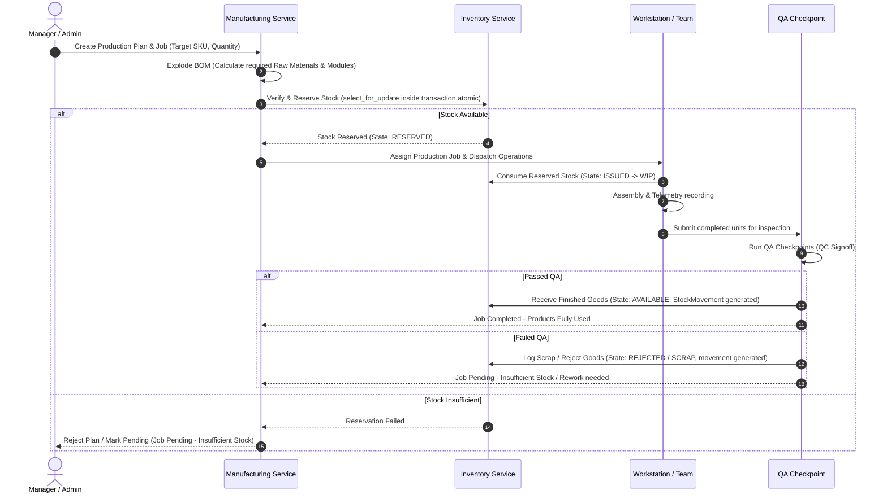

### 4.3. Phased Implementation Plan

*   **Phase 1: Foundation, Organization, Permissions, And Audit**
    Establish the organizational structure (`organization` app), capability-based permissions, and correlation-tracked audit logs (`audit` app). Set up the frontend capability-driven layouts.
*   **Phase 2: Reporting, Notifications, And HR Token Foundation**
    Implement bottom-to-top reporting routing (`reports` app) and the anonymous HR token case workflow (`hr` app). Configure scoped WebSocket notification groups.
*   **Phase 3: Inventory Industrialization And Storage Workflows**
    Extend inventory tracking with product classifications, stock states, reservations, cycle counting, and barcode scanner APIs.
*   **Phase 4: Manufacturing Core And BOM**
    Introduce the `manufacturing` app with Bill of Materials validation (loop detection), production jobs, workstation assignments, and QA checkpoints.
*   **Phase 5: Procurement, Sales, Logistics, Finance, And Marketing**
    Expand business operations with B2B sales pipelines, procurement workflow validation, shipping carriers, and budget cost-center approval chains.
*   **Phase 6: Analytics, Command Center, And Optimization**
    Create the Admin Command Center dashboard, Manager departmental metrics, and Team Lead work boards utilizing Redis caching and Celery compilation.
*   **Phase 7: Production Hardening And Package Readiness**
    Implement Sentry tracking, Prometheus metrics, outbox events, and offline-mode support for shop-floor scanner apps.

---

## 5. Development & Deployment Flow

### Git Branching Strategy

We follow a strict Git flow. Direct commits to `main` or `develop` are prohibited. All features must be branched from `develop` and merged back via Pull Requests. `main` is strictly reserved for production-ready code.

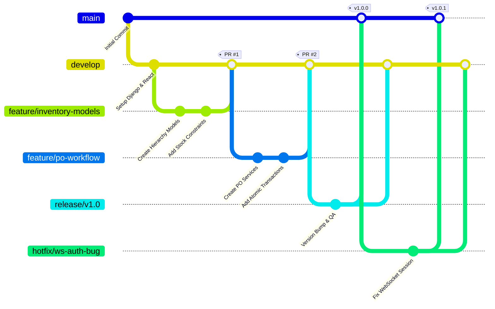

### Branch Naming Conventions
*   **Features**: `feature/<issue-number>-<brief-description>`
*   **Bug Fixes**: `bugfix/<issue-number>-<brief-description>`
*   **Hotfixes**: `hotfix/<issue-number>-<brief-description>` (branched directly from `main`)
*   **Releases**: `release/vX.Y.Z`
