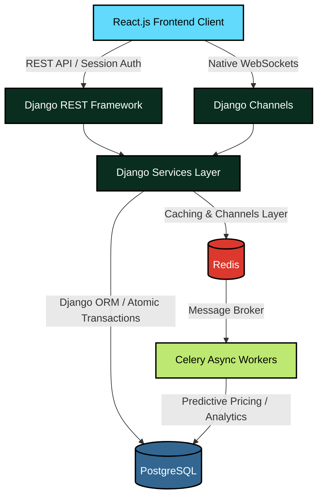
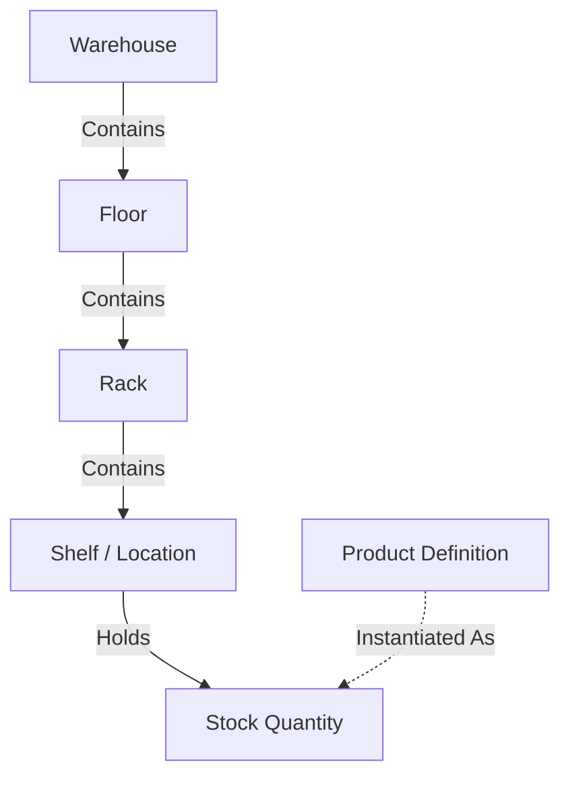
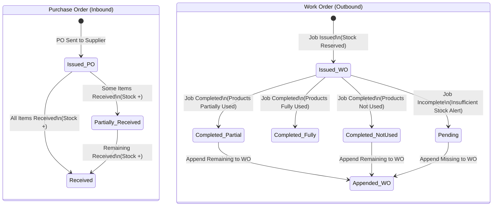
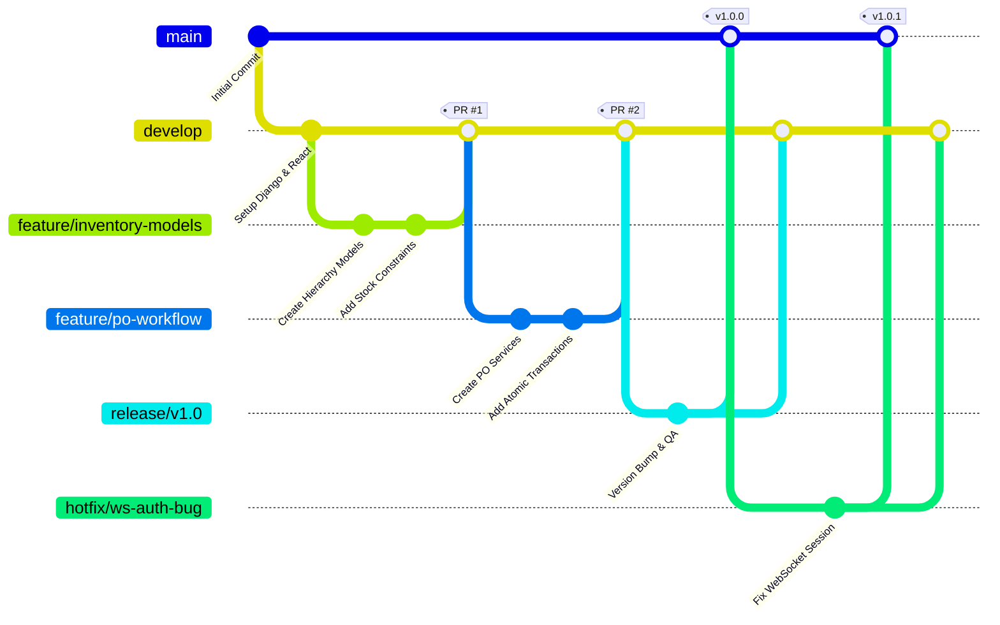

# Home Inventory Management System

Welcome to the **Home Inventory Management System**! This application is designed to meticulously track household and warehouse inventory, manage inbound (Purchase Orders) and outbound (Work Orders) stock, and provide real-time analytics and predictive pricing using a robust, highly-concurrent architecture.

---

## 1. Project Overview

### Core Technology Stack
*   **Frontend**: React.js (Vite), React Router DOM v6+, CSS Modules, Axios (with Session Credentials), Native WebSockets.
*   **Backend**: Python 3.x, Django, Django REST Framework (DRF), Django Channels (WebSockets).
*   **Database & Infrastructure**: PostgreSQL (Primary DB), Redis (Cache & Message Broker), Celery (Background Tasks), Docker.

### Business Logic Summarized
*   **Inventory Hierarchy**: Strict top-down physical mapping mapping: `Warehouse` &rarr; `Floor` &rarr; `Rack` &rarr; `Shelf (Location)`.
*   **Stock Rules**: Stock represents a specific `Product` at a specific `Location`. Stock levels **must never be negative**.
*   **Order Management**:
    *   **Purchase Orders (PO)**: Inbound stock. Supports partial and full receiving.
    *   **Work Orders (WO)**: Outbound stock (consumption). Reserves stock on issue; decrements stock on completion. Warns on insufficient stock.
*   **Predictive Pricing**: A background Celery worker analyzes market price trends to dynamically estimate future predictive prices.

### Process & Security
*   **Concurrency**: Every stock movement is enclosed within a `transaction.atomic()` block using `select_for_update()` and optimistic locking to prevent race conditions.
*   **Authentication**: Secure, HTTP-only Django Session Authentication. (No JWTs).
*   **Real-time**: Actionable events (e.g., low stock warnings, PO receipts) trigger instant WebSocket notifications.

---

## 2. Detailed Documentation

The project logic and guidelines are governed strictly by the AI Agent constraints. For deeper dives into specific layers, refer to the underlying configuration docs:

*   **Tech Stack Overview**: Detailed breakdown of the tooling and deployment constraints.
*   **Frontend Guidelines**: Rules covering React functional components, CSS module isolation, API service patterns, and WebSocket hook implementations.
*   **Backend Guidelines**: Rules for Fat Models / Thin Views, strict DRF ViewSet configurations, and Celery task isolation.
*   **Business Logic**: Rules defining the immutable audit trails, order flow mechanics, and exact hierarchy mappings.
*   **Security Rules**: Enforcement of Role-Based Access Control (RBAC), Session Auth, and database locking mechanisms.

---

## 3. Architecture & Workflow Maps

### 3.1. High-Level System Architecture

This diagram defines how the React client interacts with the Django backend via REST APIs and WebSockets, and how the backend distributes the workload.

### 3.2. Inventory Hierarchy

### 3.3. Order Processing Workflow (PO & WO)

This state machine illustrates the lifecycle of Inbound (Purchase Orders) and Outbound (Work Orders) inventory.

---

## 4. Development & Deployment Flow

### Git Branching Strategy

We follow a strict Git flow. Direct commits to `main` or `develop` are prohibited. All features must be branched from `develop` and merged back via Pull Requests. `main` is strictly reserved for production-ready code.

### Branch Naming Conventions
*   **Features**: `feature/<issue-number>-<brief-description>`
*   **Bug Fixes**: `bugfix/<issue-number>-<brief-description>`
*   **Hotfixes**: `hotfix/<issue-number>-<brief-description>` (branched directly from `main`)
*   **Releases**: `release/vX.Y.Z`